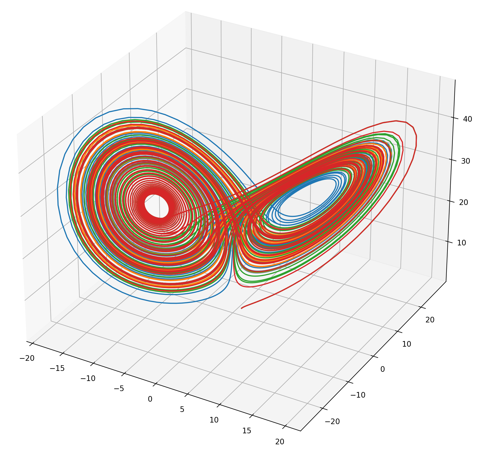

---

marp: true
theme: gaia
paginate: true
backgroundImage: url('https://marp.app/assets/hero-background.svg')
style: |
  .author-list {
    line-height: 0.4;
  }
  .container {
    display: flex;
    justify-content: space-between;
  }
  .column {
    flex: 1;
    padding: 0 10px;
  }

---

### Generating Music Variations through Chaotic Dynamical Systems Exploration

##### Rajamangala University of Technology Thanyaburi

  
Wannasa Rianthong

  
Kanatsanun Sub-udom

  
Patipan Somwong

---

### Nowaday Music AI 

###### Example of Music AI 

 

  

    

    
    

  

  

    

    
    

  

  

    

    
    

  

###### Pros and Cons of Music AI 

<table style="width: 100%; border-collapse: collapse;">
  <thead>
    <tr style="border-bottom: 1px solid black;">
      <th style="padding: 10px;"><h5>Pros</h5></th>
      <th style="padding: 10px;"><h5>Cons</h5></th>
    </tr>
  </thead>
  <tbody>
    <tr>
      <td style="padding: 10px; text-align: left; border-bottom: 0px; background-color: transparent;"><h6>user friendly</h6></td>
      <td style="padding: 10px; text-align: left; border-bottom: 0px; background-color: transparent;"><h6>high computational</h6></td>
    </tr>
    <tr>
      <td style="padding: 10px; text-align: left; border-bottom: 1px solid black; border-top: 0px;"><h6>accessible online</h6></td>
      <td style="padding: 10px; text-align: left; border-bottom: 1px solid black; border-top: 0px;"><h6>limited styles</h6></td>
    </tr>
  </tbody>
</table>

---

### Musical Variations from a Chaotic Mapping Method

  

    

      <h6> Chaotic system </h6>
      
    

  

  

    

      <h6> Music </h6>
       
       
       
      
    

  

---

#### Musical Variations from a Chaotic Mapping Method

The Lorenz system, a dynamical system with parameters $\sigma > 0$, $r > 0$ and $b > 0$ given by:

$$
\begin{aligned}
\dot{x}_1 &= \sigma(x_2 - x_1) \\
\dot{x}_2 &= rx_1 - x_2 - x_1x_3 \\
\dot{x}_3 &= x_1x_2 - bx_3
\end{aligned}
$$

if parameters set to $\sigma = 10$, $r = 28$ and $b = \dfrac{8}{3}$, it exhibits chaotic behavior.

---

### Musical Variations from a Chaotic Mapping Method
 
 

Let $\displaystyle\{p_k\}_{k=0}^{m-1}$ being a sequence of musical pitches and $\{\phi_i(kh)\}_{k=0}^{m-1}$, where $\phi_i:\mathbb{R}_+ \to \mathbb{R}$ is a numerical solution in the $i$-th component of the chaotic system. We define a mapping $g$ as
$$
\begin{equation}
g(\phi_i(kh)) := p_k
\end{equation}
$$

---

### Musical Variations from a Chaotic Mapping Method
 

Let $\{\tilde{\phi}_i(kh)\}_{k=0}^{m-1}$ is a numerical solution with new initial condition in the $i$-th component of the chaotic system. We then define another mapping $l$ as:
$$
\begin{equation} 
l(\tilde{\phi}_i(kh)) :=
\begin{cases}
g(\phi_i(b)) & \text{if } \exists\; a, b \in \text{dom }\phi_i \text{ s.t. } \phi_i(a) < \tilde{\phi}_i(kh) \leq \phi_i(b) \\
& \text{and } \nexists\, c \in \text{dom }\phi_i\text{ s.t. } \phi_i(a) < \phi_i(c) \leq \phi_i(b) \\
g(\phi_i(a)) & \text{if } \tilde{\phi}_i(kh) < \phi_i(a) \text{ for all } a \in \text{dom }\phi_i \\
g(\phi_i(b)) & \text{otherwise}
\end{cases}
\end{equation}
$$

---

### Process of Musical Variations Method
 
 
 

  <h6>Original</h6>
  
   
  <audio controls>
    <source src="mp3/dabby_1.mp3" type="audio/mpeg">
  Your browser does not support the audio element.
  </audio>

---

### Process of Musical Variations Method
 

  
   
   
  
   
   
  

---

### Process of Musical Variations Method
 

  
   
   
  
   
   
  
   
   

---

### Process of Musical Variations Method
 

  <h6>Variation</h6>
   
  
  
   
  <audio controls>
    <source src="mp3/dabby_2.mp3" type="audio/mpeg">
  Your browser does not support the audio element.
  </audio>

---

### Melodic Variation with Expanded Rhythm Method
This technique extends the rhythmic duration of musical notes, thereby opening up a number of possibilities for creating new musical variations.

  

    

    <h6>Original</h6>
      
       
      <audio controls>
        <source src="mp3/er_1.mp3" type="audio/mpeg">
        Your browser does not support the audio element.
      </audio>
    

  

  

    

    <h6>Expanded Rhythm</h6>
      
      <audio controls>
        <source src="mp3/er_12.mp3" type="audio/mpeg">
        Your browser does not support the audio element.
      </audio>
    

  

---

### Process of Expanded Rhythm Method

 

  
   
   
  
   
   
  

---

### Process of Expanded Rhythm Method

 

  
   
   
  
   
   
  

---

### Process of Expanded Rhythm Method

 

<h6>Variation</h6>
   
  
   
  
   
  <audio controls>
    <source src="mp3/er_2.mp3" type="audio/mpeg">
  Your browser does not support the audio element.
  </audio>

---

### Example from Expanded Rhythm Method

 

Pachelbel - Canon in D

  

    

    <h6>Original Variation</h6>
      <audio controls>
        <source src="mp3/original_cnd.mp3" type="audio/mpeg">
        Your browser does not support the audio element.
      </audio>
    

  

  

    

    <h6>New Variation</h6>
      <audio controls>
        <source src="mp3/new_cnd.mp3" type="audio/mpeg">
        Your browser does not support the audio element.
      </audio>
    

  

 

Yiruma, (이루마) - River Flows in You

  

    

    <h6>Original Variation</h6>
      <audio controls>
        <source src="mp3/original_rfiy.mp3" type="audio/mpeg">
        Your browser does not support the audio element.
      </audio>
    

  

  

    

    <h6>New Variation</h6>
      <audio controls>
        <source src="mp3/new_rfiy.mp3" type="audio/mpeg">
        Your browser does not support the audio element.
      </audio>
    

  

---

### Future Approach

<h6> Melodic variation </h6>

<h6> Rhythmic variation </h6>

---

<H1> Q&A </H1>
 

