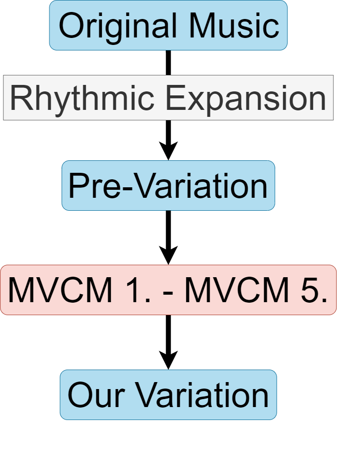

---

marp: true
theme: gaia
paginate: true
backgroundImage: url('https://marp.app/assets/hero-background.svg')
style: |
  .author-list {
    line-height: 0.4;
  }
  .container {
    display: flex;
    justify-content: space-between;
  }
  .column {
    flex: 1;
    padding: 0 10px;
  }
  img[alt~="center"] {
    display: block;
    margin: 0 auto;
  }
  svg[id^="mermaid-"] { 
    min-width: 550px; 
    max-width: 960px; 
    min-height: 400px; 
    max-height: 500px;
  }

---

#### Generating Music Variations through Chaotic Dynamical Systems Exploration

###### Rajamangala University of Technology Thanyaburi

  
Wannasa Rianthong

  
Kanatsanun Sub-udom

  
Patipan Somwong

---

#### Nowaday Music AI 

###### Example of Music AI 

 

  

    

    
    

  

  

    

    
    

  

  

    

    
    

  

###### Pros and Cons of Music AI 

<table style="width: 100%; border-collapse: collapse;">
  <thead>
    <tr style="border-bottom: 1px solid black;">
      <th style="padding: 10px;"><h5>Pros</h5></th>
      <th style="padding: 10px;"><h5>Cons</h5></th>
    </tr>
  </thead>
  <tbody>
    <tr>
      <td style="padding: 10px; border-bottom: 0px; background-color: transparent;"><h6>user friendly</h6></td>
      <td style="padding: 10px; border-bottom: 0px; background-color: transparent;"><h6>high resource</h6></td>
    </tr>
    <tr>
      <td style="padding: 10px; border-bottom: 1px solid black; border-top: 0px;"><h6>support various style</h6></td>
      <td style="padding: 10px; border-bottom: 1px solid black; border-top: 0px;"><h6>unrepeatable</h6></td>
    </tr>
  </tbody>
</table>

---

 
> D. S. Dabby (1996), Musical Variations from a Chaotic Mapping, Chaos, 6 (2): pp. 95–107. 

---

##### MVCM 1. Find a sequence of music pitches (SMP)
 

  <h6>Original</h6>
   
  
  
   
  <audio controls>
    <source src="mp3/dabby_1.mp3" type="audio/mpeg">
  Your browser does not support the audio element.
  </audio>

---

##### MVCM 2. Determine a trajectory (TRAJ)

$$
\begin{aligned}
\dot{x}_1 &= 10(x_2 - x_1) \\
\dot{x}_2 &= 28x_1 - x_2 - x_1x_3 \\
\dot{x}_3 &= x_1x_2 - 2.67x_3
\end{aligned}
\implies
\boxed{\begin{array}[c]
\text{RK4} \\
x_1(0) = x_2(0) = x_3(0) = 1.00 \\
h = 0.01
\end{array}}
$$

|       | $t = 0$ | $t = h$ | $t = 2h$ | $t = 3h$ | $t = 4h$ | $\dots$ | $t = 9h$ | $t =  10h$ |
| ----- | ------ | ------ | ------ | ------ | ------ | ------ | ------ | ------ |
| $k$ | 0 | 1 | 2 | 3 | 4 | $\dots$ | 9 | 10 |
| $x_1$ | 1.00 | 1.29 | 2.13 | 3.74 | 6.54 | $\dots$ | 7.55 | 1.20 | 
| $x_2$ | 1.00 | $\dots$ | $\dots$ | $\dots$ | $\dots$ | $\dots$ | $\dots$ | $\dots$ |
| $x_3$ | 1.00 | $\dots$ | $\dots$ | $\dots$ | $\dots$ | $\dots$ | $\dots$ | $\dots$ |

----- 

#### MVCM 3. Construct a mapping: SMP vs TRAJ

 

  <section data-marpit-fragments="1">
  
   
   
  
   
   
  
  </section>

---

#### MVCM 4. Alternate the initial condition

$$
\begin{aligned}
\dot{x}_1 &= 10(x_2 - x_1) \\
\dot{x}_2 &= 28x_1 - x_2 - x_1x_3 \\
\dot{x}_3 &= x_1x_2 - 2.67x_3
\end{aligned}
\implies
\boxed{\begin{array}[c]
\text{RK4} \\
{\color{blue}x_1(0) = 1.01}, x_2(0) = x_3(0) = 1.00 \\
h = 0.01
\end{array}}
$$

|       | $t = 0$ | $t = h$ | $t = 2h$ | $t = 3h$ | $t = 4h$ | $\dots$ | $t = 9h$ | $t =  10h$ |
| ----- | ------ | ------ | ------ | ------ | ------ | ------ | ------ | ------ |
| $k$ | 0 | 1 | 2 | 3 | 4 | $\dots$ | 9 | 10 |
| $x_1$ | 1.01 | 1.30 | 2.15 | 3.76 | 6.58 | $\dots$ | 7.48| 1.15 | 
| $x_2$ | 1.00 | $\dots$ | $\dots$ | $\dots$ | $\dots$ | $\dots$ | $\dots$ | $\dots$ |
| $x_3$ | 1.00 | $\dots$ | $\dots$ | $\dots$ | $\dots$ | $\dots$ | $\dots$ | $\dots$ |

----- 

#### MVCM 5. Construct the sequence of new music pitch

 

  
   
   
  
   
   

---

#### MVCM 5. Construct the sequence of new music pitch
 

  
   
   
  
   
   
  
   
   

---

#### Result

  

    

      <h6>Original</h6>
      
      
      <audio controls>
        <source src="mp3/dabby_1.mp3" type="audio/mpeg">
      Your browser does not support the audio element.
      </audio>
    

  

  

    

      <h6>Variation</h6>
      
      
      <audio controls>
        <source src="mp3/dabby_2.mp3" type="audio/mpeg">
      Your browser does not support the audio element.
      </audio>
    

  

 
| k | 0 | 1 | 2 | 3 | 4 | 5 | 6 | 7 | 8 | 9 | 10 |
| ----- | :-----: | :-----: | :-----: | :-----: | :-----: | :-----: | :-----: | :-----: | :-----: | :-----: | :-----: |
| Original | C4 | C4 | G4 | G4 | A4 | A4 | G4 | F4 | F4 | E4 | E4 |s 
|Variation | E4 | G4 | G4 | A4 | E4 | F4 | F4 | F4 | F4 | E4 | E4 | 
| Difference | 3 | 5 | 0 | 1 | 4 | 3 | 1 | 0 | 0 | 0 | 0 |

---

#### Melodic Variation with Expanded Rhythm 
  

  <h6>Original</h6>
    
     
    
     
  

  

  <h6>Expanded Rhythm</h6>
    
     
    
  

---

#### Our Method
<section data-marpit-fragments="1">
  

    

      

        <h6> Our Method Diagram</h6>
        
      

    

    

      

        <h6>Process in MVCM 1. - MVCM 5. </h6>
        
      

    

  

</section>

---

#### Our Method

 

<h6>Our Variation</h6>
   
  
   
  
   
  <audio controls>
    <source src="mp3/er_2.mp3" type="audio/mpeg">
  Your browser does not support the audio element.
  </audio>

---

#### Our Result
 
 

Let $\displaystyle\{p_k\}_{k=0}^{m-1}$ being a sequence of musical pitches with expanded rhythms and $\{\phi_i(kh)\}_{k=0}^{m-1}$, where $\phi_i:\mathbb{R}_+ \to \mathbb{R}$ is a numerical solution in the $i$-th component of the chaotic system. We define a mapping $g$ as
$$
\begin{equation}
g(\phi_i(kh)) := p_k
\end{equation}
$$

---

#### Our Result
 

Let $\{\tilde{\phi}_i(kh)\}_{k=0}^{m-1}$ is a numerical solution with new initial condition in the $i$-th component of the chaotic system. We then define another mapping $l$ as:
$$
\begin{equation} 
l(\tilde{\phi}_i(kh)) :=
\begin{cases}
g(\phi_i(b)) & \text{if } \exists\; a, b \in \text{dom }\phi_i \text{ s.t. } \phi_i(a) < \tilde{\phi}_i(kh) \leq \phi_i(b) \\
& \text{and } \nexists\, c \in \text{dom }\phi_i\text{ s.t. } \phi_i(a) < \phi_i(c) \leq \phi_i(b) \\
g(\phi_i(a)) & \text{if } \tilde{\phi}_i(kh) < \phi_i(a) \text{ for all } a \in \text{dom }\phi_i \\
g(\phi_i(b)) & \text{otherwise}
\end{cases}
\end{equation}
$$

---

#### Examples from Expanded Rhythm 

 

Pachelbel - Canon in D

  

    

    <h6>Original</h6>
      <audio controls>
        <source src="mp3/original_cnd.mp3" type="audio/mpeg">
        Your browser does not support the audio element.
      </audio>
    

  

  

    

    <h6>Variation</h6>
      <audio controls>
        <source src="mp3/new_cnd.mp3" type="audio/mpeg">
        Your browser does not support the audio element.
      </audio>
    

  

 

Yiruma, (이루마) - River Flows in You

  

    

    <h6>Original</h6>
      <audio controls>
        <source src="mp3/original_rfiy.mp3" type="audio/mpeg">
        Your browser does not support the audio element.
      </audio>
    

  

  

    

    <h6>Variation</h6>
      <audio controls>
        <source src="mp3/new_rfiy.mp3" type="audio/mpeg">
        Your browser does not support the audio element.
      </audio>
    

  

---

#### Future Approach

<h6> Melodic variation </h6>

<h6> Rhythmic variation </h6>

---

<H1> Q&A </H1>
 

